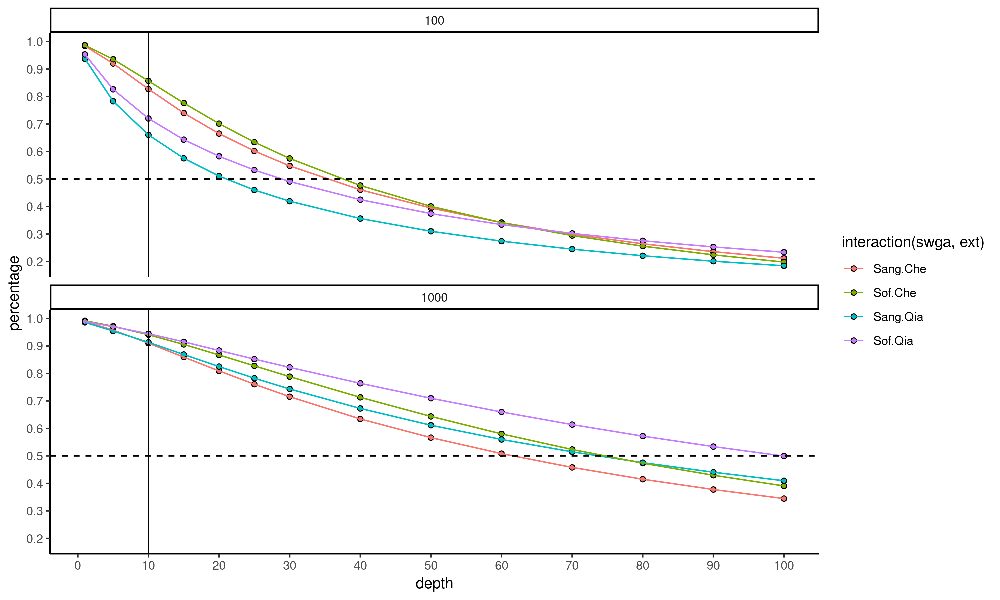
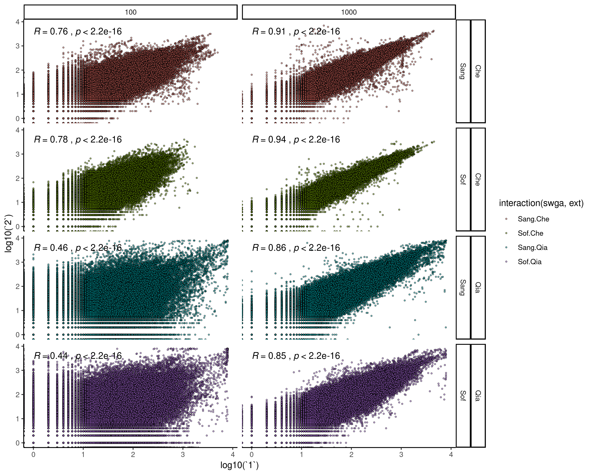
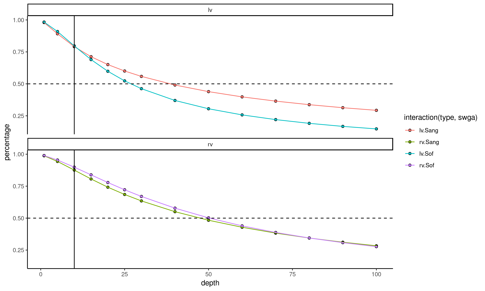
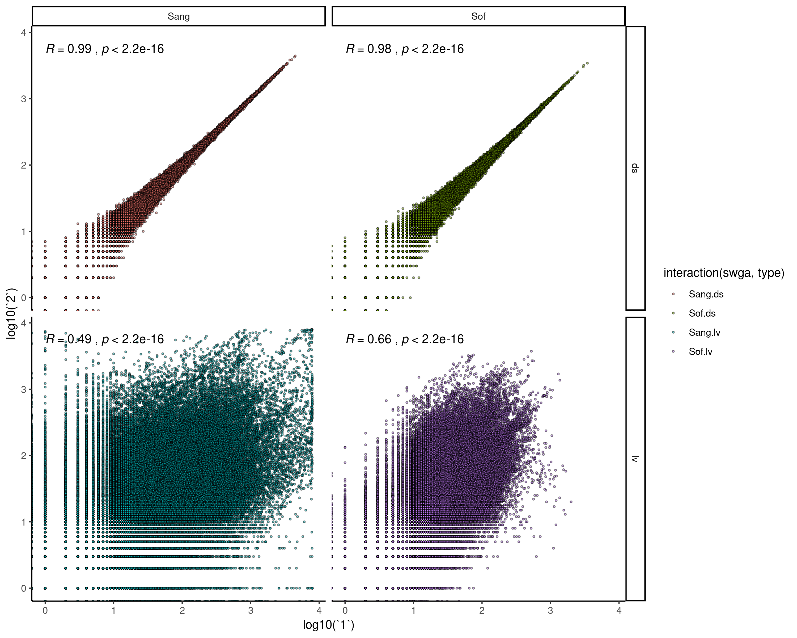
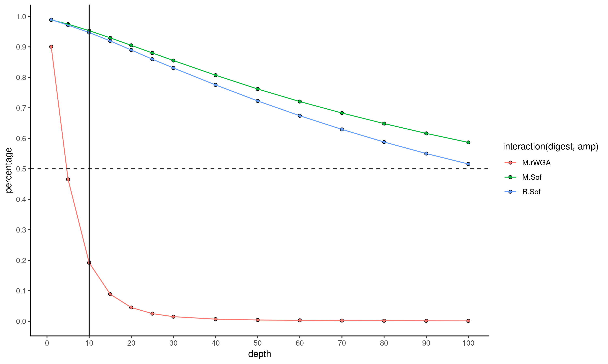
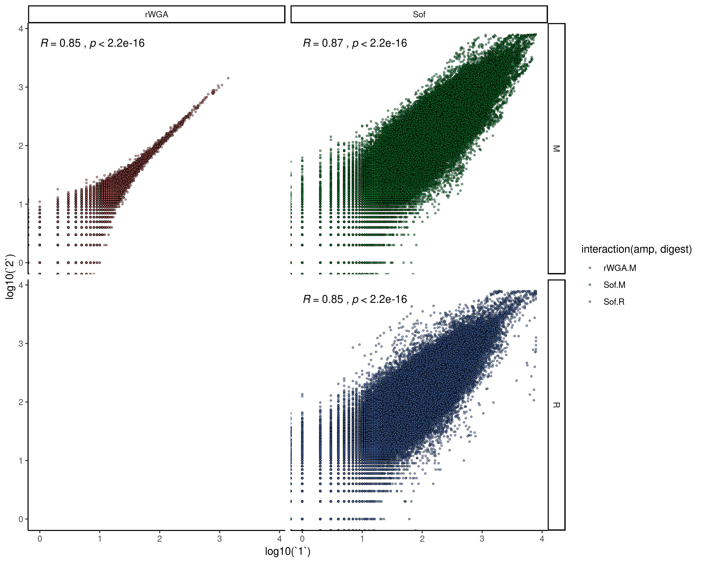

# Whole Genome Sequencing Methods Analyses

## Main Comparison
**Figure 1** - Percentage of the genome covered at depth separated by sWGA and extraction methods combinations

**Figure 2** - Correlation plots positional depth (binned across 200bp) of replicates of sWGA and extraction method combinations.

## Large Volume sWGA
**Figure 3** - Large volume sWGA vs regular volume sWGA in percentage of genome at specific depths.

**Figure 4** - Comparison of of large volume and downsampled normal volume.

## MCRBC Digest
**Figure 5** - Percentile plot of MCRBC and no digest with and without sWGA.

**Figure 6** - Correlation plot of MCRBC and no digest with and without sWGA

